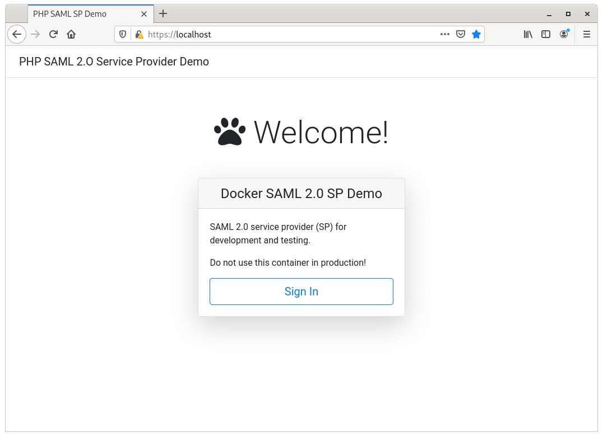
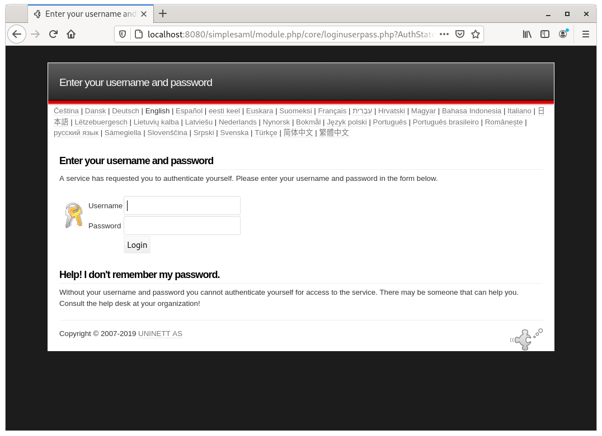
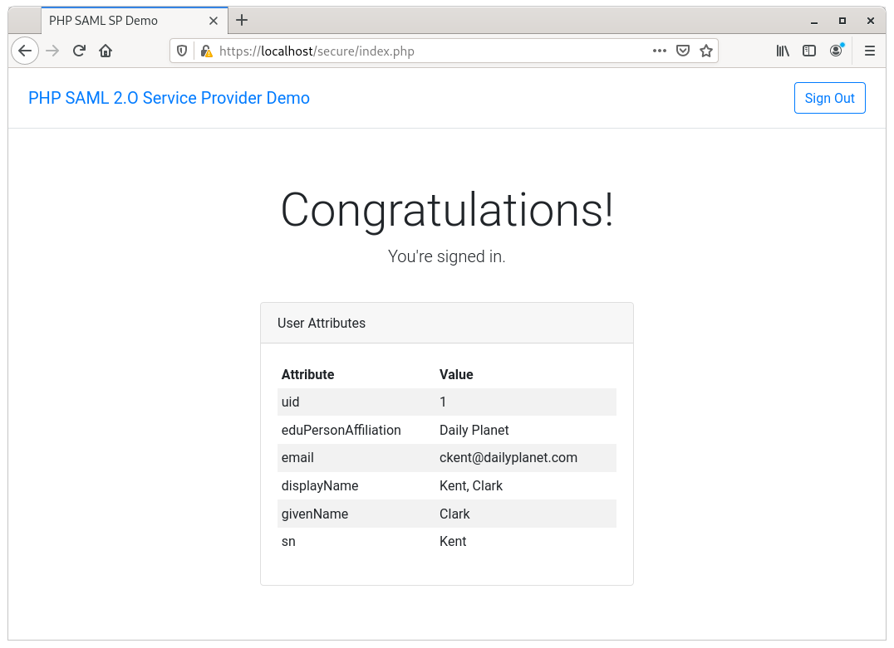
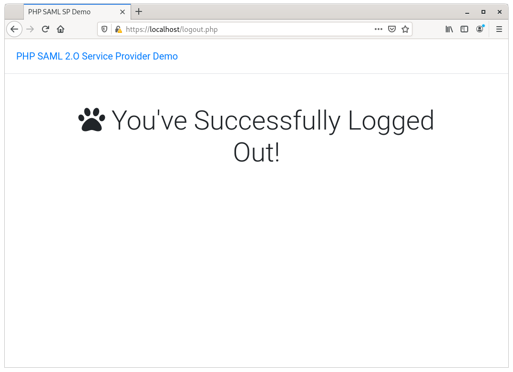

# saml-2.0-demo

A set of modules for demonstrating SAML 2.0 single sign-on (SSO) login.

### Modules

Below is the list of modules used for the demo:

- [saml-idp-demo](saml-idp-demo)
- [saml-sp-shibboleth-demo](saml-sp-shibboleth-demo)
- [saml-sp-springboot-demo](saml-sp-springboot-demo)

The **saml-idp-demo** module is the identity provider (IdP) module.  Both **saml-sp-shibboleth-demo** and **saml-sp-springboot-demo** are the service providers (SP) modules.  Note that the last module is the Java version of SP. It will not be discussed in this demo.  You can go to that module for instrucations on how to run it if you would like to see how it works. 

### Prerequisites - You must have the following installed:
- Docker 19.x

Please follow the [Docker installation guide](https://docs.docker.com/get-docker/).

## Run the Demo

A pre-configured docker image of IdP and SP are provided in Docker Hub to get the demo up and running quickly.

First, we need to the IdP service to provide federate login for the SPs.  Open up a terminate and execute the following command:

```
docker run -d --name=saml-idp-demo \
-p 8080:8080 \
-p 8443:8443 \
-e SIMPLESAMLPHP_ADMIN_PASSWORD=admin123 \
-e SIMPLESAMLPHP_UID=1 \
-e SIMPLESAMLPHP_USERNAME=ckent \
-e SIMPLESAMLPHP_PASSWORD=superman \
-e SIMPLESAMLPHP_GROUP="Daily Planet" \
-e SIMPLESAMLPHP_EMAIL=ckent@dailyplanet.com \
-e SIMPLESAMLPHP_FIRST_NAME=Clark \
-e SIMPLESAMLPHP_LAST_NAME=Kent \
-e SIMPLESAMLPHP_DISPLAY_NAME="Clark Kent (Kal-El)" \
kvb2univpitt/saml-idp-demo:v1.2021.4
```

The above command will download the IdP docker image from Docker Hub and run it in a docker container with the following pre-configured admin and user accounts:

#### Admin Account
| Username | Password |
|---|---|
| admin | admin123 |

#### User Account
| UID | Username | Password | Group | Email | First Name | Last Name | Preferred Name |
|---|---|---|---|---|---|---|---|
| 1 | ckent | superman | Daily Planet | ckent@dailyplanet.com | Clark | Kent | Clark Kent (Kal-El) |

You can access the IdP at [http://localhost:8080/simplesaml](http://localhost:8080/simplesaml).

Next, we will run the SP.  This is where are services/resources are accessed by the user once signed in.  Open up a terminal and execute the following command:

```
docker run -d --name=saml-sp-shibboleth-demo \
-p 80:80 \
-p 443:443 \
kvb2univpitt/saml-sp-shibboleth-demo:v1.2021.4
```

The above command will download the SP docker image from Docker Hub and run it in a docker container.

You can access the application at [https://localhost/](https://localhost/).

You should see the welcome page.  Click the "Sign In" button to log in.



Sign in with the username **ckent** and the password **superman**.



You should see the welcome page with a list of the user information (attributes) associated with the user account.



Click the "Sign Out" button on the top right corner to log out.


