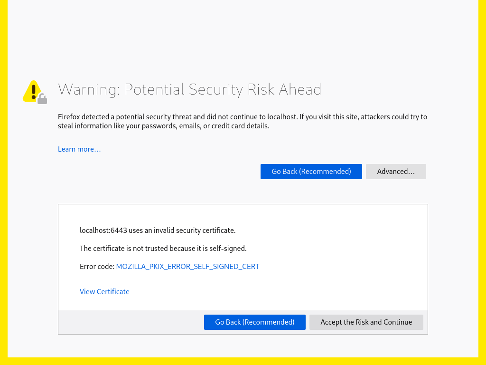
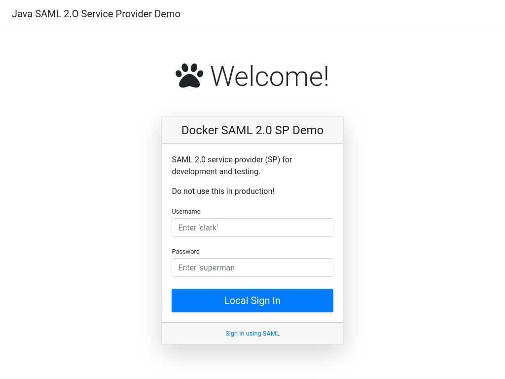
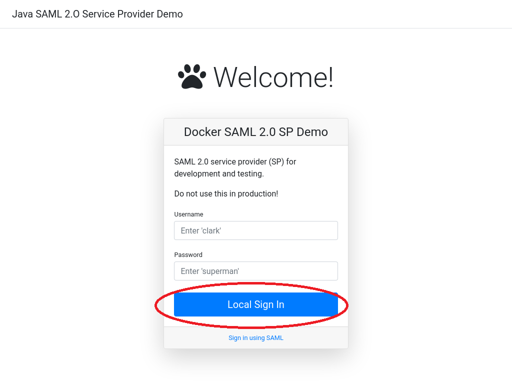
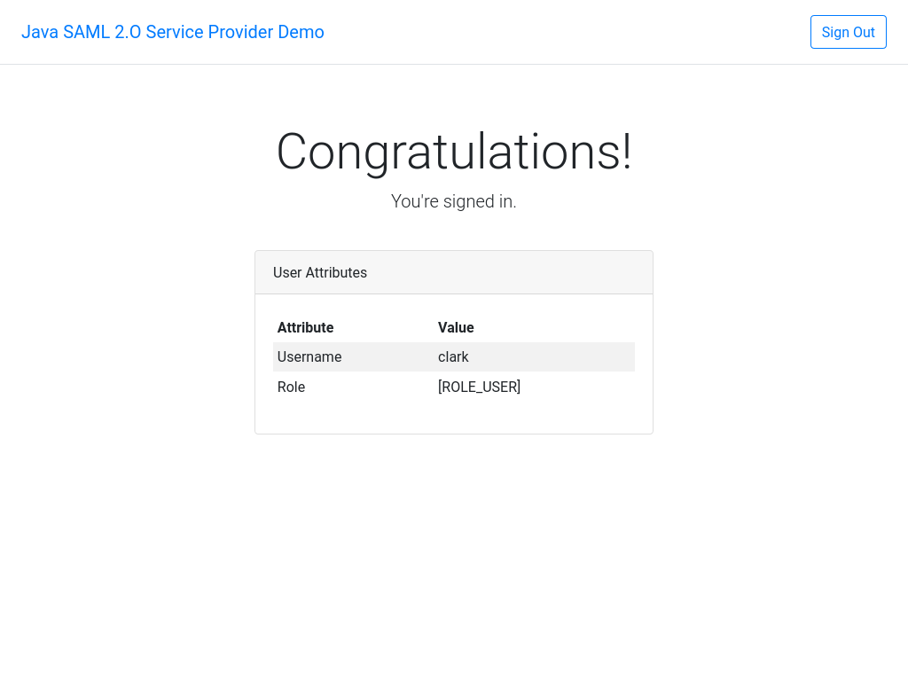
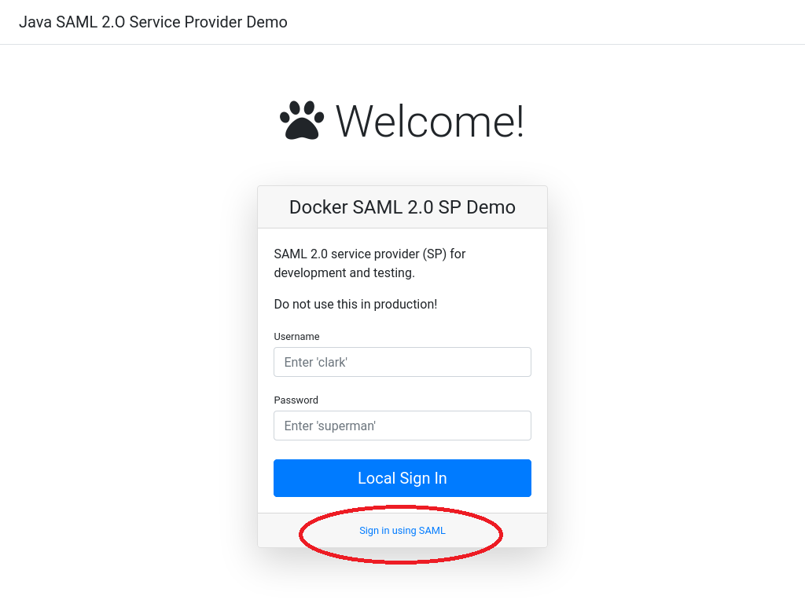
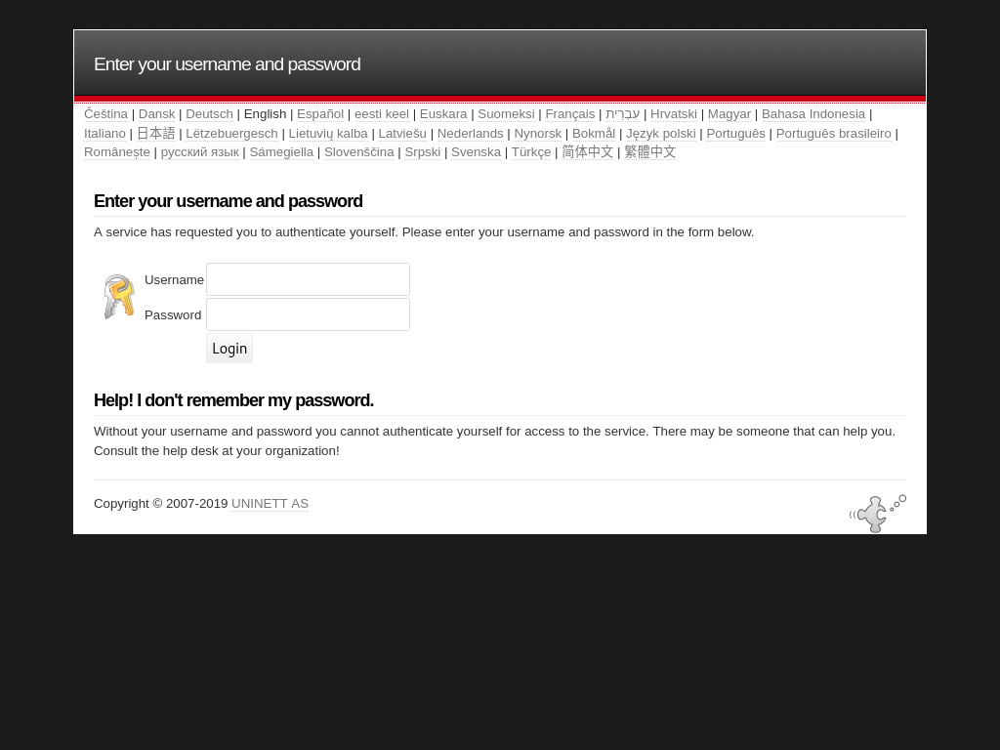
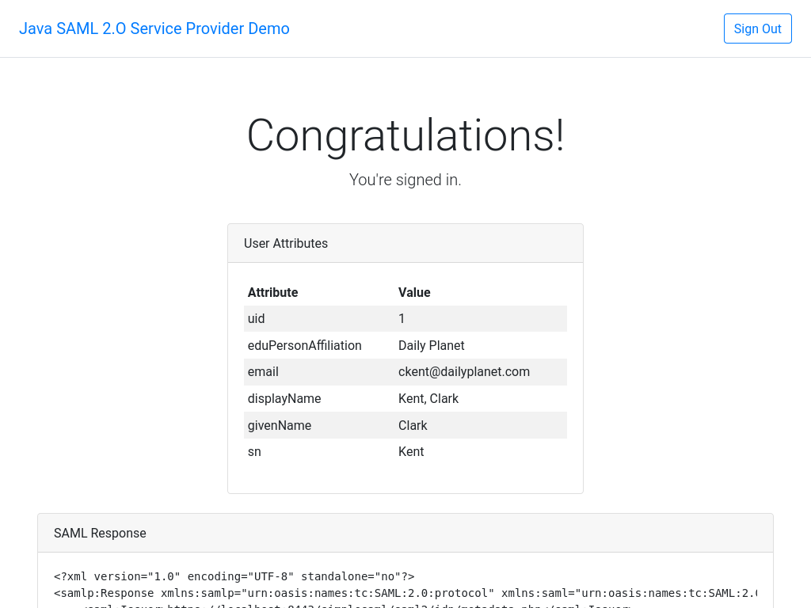

# saml-sp-springboot-demo
Initially, this was a simple Spring Boot application for demonstrating SAML 2.0 service provider (SP).  However, it was later modified to demonstratte both local authentication and SAML authetication.

A local authentication uses a local database specifically created for the application that holds application data and user credentials.  When a user login, the application compares the user's credentials submitted against its database to verify the user.

A SAML authentication uses a remote server, known as identity provider or IdP, to verify the user on the behave of the application, known as service provider or SP.  In other words, the application relies on a third-party service to authenticate the user.  Thus, the application sometimes refers to as the "relying" party while the IdP refers to as the "assertion" party. 

For more information on SAML, please see the [Okta Developer: Understanding SAML](https://developer.okta.com/docs/concepts/saml/)

 ## Prerequisites
 You will need to download and install the following:
 - Java SDK 8 or higher ([Oracle JDK](https://www.oracle.com/java/technologies/javase-downloads.html) or [OpenJDK](https://adoptopenjdk.net/))
 - [Apache Maven 3.x.x](https://maven.apache.org/download.cgi)
 - [Docker](https://docs.docker.com/get-docker/)

 You will use Java SDK and Apache Maven to compile and run the demo application.  You will use Docker to run a demo SAML 2.0 IdP.

## Run the SAML 2.0 Service Provider (SP)
First, we need to run the [demo SAML 2.0 identity provider](../saml-idp-simplesamlphp-demo/README.md).  This will allow us to sign in remotely and pass the user's profile and verification to the application (service provider).

We are now ready to run the SAML service provider.  Download and extract the source code to a folder.  Go to the folder **saml-sp-springboot-demo** and execute the following command to run the service provider:

```
./mvnw spring-boot:run
```

Launch your browser and go to [https://localhost:6443/login](https://localhost:6443/login).
You will see a warning for potential security risk because the SSL certificate is not officially signed.  Just click on the "Advance" button and the "Accept the Risk and Continue" button.



You should see the login page.



### Local Sign In
We will first demonstrate the local authentication.  Type in ***clark*** in the username field and ***superman*** in the password field.  Now click the blue 'Local Sign In' button to log in locally.



Once the application verifies your credentials against the local database, you will be authenticated and redirected to the main page that displays the user's information retrieved from the local database:




Now click the "Sign Out" button on the top right to log off.

### SAML Sign In
We will now demonstration SAML sign in.  Click on the link "Sign in using SAML" below the "Local Sign In" button.



The application will redirect you to the login page of the identity provider.  *You may encounter the warning for potential security risk because of the unsigned SSL certificate again.  Just click accept.*  Enter the username  ***ckent*** and the password ***batman***.  Now click the "login" button.



Once the IdP verifies your credentials, it will redirect you back to the service provider.  You are now authenticated.  You will see the following main page displaying user's profile and SAML response from the IdP.



Click the "Sign Out" button on the top right to log off.

### Shutdown the Service Provide
Hit Ctrl-C keys to stop the application.

## Run With an Apache Web Server Front End
A protocol must be setup to proxies requests from Apache web server to the Tomcat server.  This protocol is called Apache JServ Protocol (AJP).  To learn more about AJP, please visit the [Apache Tomcat Connectors: AJP Protocol Reference](https://tomcat.apache.org/connectors-doc/ajp/ajpv13a.html).

Create a file called **ajpsaml.conf** with the following content to the directory **/etc/httpd/conf.d**.

CentOS 7:
```xml
<VirtualHost _default_:443>
    SSLEngine on
    SSLProtocol all -SSLv2 -SSLv3
    SSLCipherSuite HIGH:3DES:!aNULL:!MD5:!SEED:!IDEA
    SSLCertificateFile /etc/pki/tls/certs/localhost.crt
    SSLCertificateKeyFile /etc/pki/tls/private/localhost.key

    ProxyPreserveHost on
    ProxyRequests on
    ProxyPass / ajp://localhost:9090/ secret=7ee2fd11-14b3-402c-a512-cd9c1206ef5f
    ProxyPassReverse / ajp://localhost:9090/ secret=7ee2fd11-14b3-402c-a512-cd9c1206ef5f
</VirtualHost>
```

CentOS 8:
```xml
<VirtualHost _default_:443>
  SSLEngine on
  SSLHonorCipherOrder on
  SSLCipherSuite PROFILE=SYSTEM
  SSLProxyCipherSuite PROFILE=SYSTEM
  SSLCertificateFile /etc/pki/tls/certs/localhost.crt
  SSLCertificateKeyFile /etc/pki/tls/private/localhost.key

  ProxyPreserveHost on
  ProxyRequests on
  ProxyPass / ajp://localhost:9090/ secret=7ee2fd11-14b3-402c-a512-cd9c1206ef5f
  ProxyPassReverse / ajp://localhost:9090/ secret=7ee2fd11-14b3-402c-a512-cd9c1206ef5f
</VirtualHost>
```

Set ajp properties under the ***Apache JServ Protocol (AJP)*** section in the application.properties file.  For an example:
```properties
# Apache JServ Protocol (AJP) 
tomcat.ajp.enabled=true
tomcat.ajp.port=9090
tomcat.ajp.port.redirect=6443
tomcat.ajp.secret=7ee2fd11-14b3-402c-a512-cd9c1206ef5f
```
